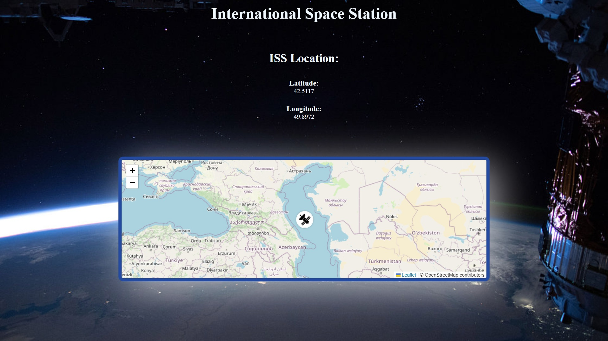

# 🛰️ ISS Live Tracker

A React app that shows the real-time location of the International Space Station (ISS) on an interactive map.

---

## 🚀 Features

- 🌐 Live latitude and longitude fetched from [Open Notify API](http://api.open-notify.org/iss-now.json)
- 🗺️ Interactive map using **React Leaflet** and **OpenStreetMap** tiles
- 📍 Custom ISS satellite icon for easy tracking
- 🔄 Updates location every 5 seconds with smooth recentering
- 📱 Fully responsive design with centered layout and clean styling

---

## 🧑‍💻 Tech Stack

- React
- React Leaflet
- OpenStreetMap
- Axios / Fetch API
- CSS3 / Flexbox

---

## 📸 Screenshots

### 🛰️ Satellite Icon and Position Info

